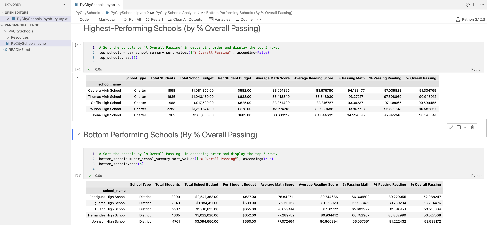

# Panda Challenge

## Description
You are the new Chief Data Scientist for your city's school district. In this capacity, you'll be helping the school board and mayor make strategic decisions regarding future school budgets and priorities.  As a first task, you've been asked to analyze the district-wide standardized test results. You'll be given access to every student's math and reading scores, as well as various information on the schools they attend. Your task is to aggregate the data to showcase obvious trends in school performance.

## Table of Contents
- [Installation](#installation)
- [Usage](#usage)
- [Credits](#credits)
- [License](#license)
- [Features](#features)

- [Contact](#contact)

## Installation
python, csv reader

## Usage
Run PyCitySchools.ipynb 

## Credits
Jennifer Harris

## License
MIT

## Features
Summarizes district and school test scores and budgets

## Contact
If there are any questions of concerns, I can be reached at:
##### [github: Jennifer Harris](https://github.com/Jennifer Harris)
##### [email: jennifer.v.harris@outlook.com](mailto:jennifer.v.harris@outlook.com)
